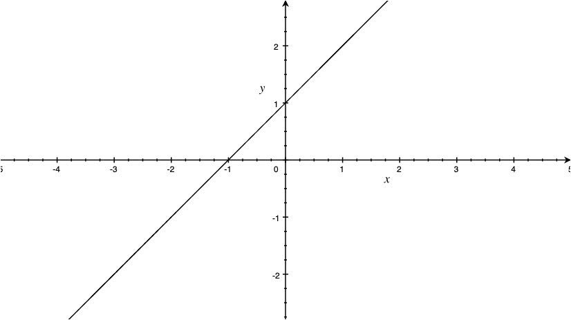
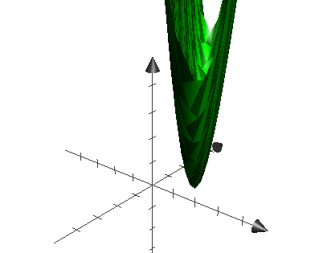
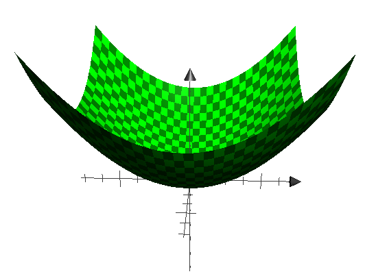

# 基本思想

##  问题数学描述

有一组样本数据 ,假定为 $n$ 组， 如下所示：

```python
x = [1.0, 2.0, 3.0, 4.0, 5.0, 6.0, 7.0, 8.0, 9.0 , 10.0]
y = [2.0, 4.1, 6.3, 7.9, 9.8, 11.5, 14.3, 16.6, 18.1, 21]
```

即：
$$
x_1 = 1.0,  x_2=2.0,...\\
y_1 = 2.0, y_2 = 4.1,....
$$
 需要推断一个函数，能够满足这一组样本值的特征，这个推断的过程叫做**机器学习**。

从 $[x, y]$ 的散点图来看，感觉是个一元一次方程（即采用了**线性模型**），如图 1所示。



<center>图1 二维线性函数图像</center>

假定为
$$
y=wx+b \tag 1
$$
只要能计算出w, b，那么就得到了这个函数，同时从数据分布来看，公式（1）为一条直线，对于某个给定的值$x_i$，计算出的值 $y'_i$ 跟样本集中对应的实际值 $y_i$ 是有误差的 。通常通过均方差（**最小二乘法**）来评价这种误差，即
$$
loss = \frac{1}{n}\sum^{n}_{i=1}(y'_i-y_i)^2\tag 2
$$
公式（2）在机器学习中称之为**损失函数**。需要求解的就是组合
$$
[w, b]\tag 3
$$
使得公式（2）中的函数值 $loss$ 达到其最小值。为了便于说明问题，将公式（1）代入公式（2），即
$$
\begin{align}
loss &= \frac{1}{n}\sum^{n}_{i=1}(y'_i-y_i)^2\\
&=\frac{1}{n}\sum^{n}_{i=1}(wx_i+b-y_i)^2
\tag 5
\end{align}
$$
公式（5）中，$n,x_i, y_i$ 都是由样本集决定的，即为已知参数。$w, b$ 为未知参数。

##  简化计算

为了简化问题方便推导，只使用样本集中的 2个样本值，即 $n = 2$，代入样本数据，计算 $loss$ 的值： 
$$
\begin{align}
loss &= \frac{1}{2}[(w\times1.0 + b -2.0)^2+(w\times2.0 + b -4.1)^2]\\
&=\frac{1}{2}[(w+b-2)^2+(2w+b-4.1)^2]\\
&=(推导省略...）\\
&=5w^2+2b^2+6wb-20.04w-12.2b+20.81
\end{align}\tag6
$$
问题转化为求公式（6）这个函数的最小值了，将公式（6）中的$loss$ 换成 $z$,  $w,b$分别换成 $x, y$,（只是个人习惯而已，不换也可以），即：
$$
z=5x^2+2y^2+6xy-20.0x-12.2y+20.81\tag7
$$
求公式（7）的函数最小值。公式（7）函数达到其最小值时其自变量 $x,y$ 的值，即公式（6）中的 $w, b$ 的值，就是符合2个样本值（$n=2$）的拟合函数的待定系数。公式（7）函数的三维图像如图2所示。



<center>图 2 函数三维图像</center>

# 梯度下降法

##  导数含义

公式（5）求解的过程，引入了**梯度下降法**。公式（5）是一个关于 $w, b$ 的二元一次方程
$$
\begin{align}
loss &=\frac{1}{n}\sum^{n}_{i=1}(wx_i+b-y_i)^2
\tag 5
\end{align}
$$
对于给定的样本集，$n, x_i,y_i$ 都是已知的参数，$w,b $ 是自变量， $loss$ 是关于 $w,b$ 的函数。

梯度下降法的基本思想就是沿着函数斜率下降的方向前进，直到到达斜率为 $0$ 的点，则该点就是函数的最小值点，前提是函数存在最小值。那么什么是斜率呢？斜率就是函数对自变量进行求导，例如，对于一元（元，即自变量的个数）二次（二次，即函数的最高次幂）函数 $f(x)=x^2$ ，对于函数曲线上的任何一个点 $x$ , 此处的斜率为 $f(x)$ 对 $x$ 求导，即： 
$$
\frac{df(x)}{dx} = \frac{d(x^2)}{dx} = 2x
$$
以此类推，对于二元二次函数 $f(x, y)=x^2 + y^2$, 则是求偏导。$f(x,y)$是一个三维空间的曲面，如图 3 所示。



<center>图 3 函数三维图像</center>

偏导就是在曲面上某个点的切面和坐标轴所在面的交叉线方向的斜率，例如，在 $[x,y, z]$ 点对自变量 $x$ 求偏导，就是函数的曲面上该点的切面与 $z$ 轴和 $x$ 轴形成的平面的交叉线的斜率。由于函数曲面的切面上有很多方向，偏导就是指定了某一个方向。

##  求导

公式（5）对 $w$ 求导:
$$
\begin{align}
\frac{d(loss)}{dw} &=\frac{d[\frac{1}{n}\sum^{n}_{i=1}(wx_i+b-y_i)^2]}{dw}\\
&=\frac{1}{n}\frac{d[\sum^{n}_{i=1}(wx_i+b-y_i)^2]}{dw}\\
&=\frac{1}{n}\sum^{n}_{i=1}\frac{d[(wx_i+b-y_i)^2]}{dw}\\
\tag 5
\end{align}
$$


